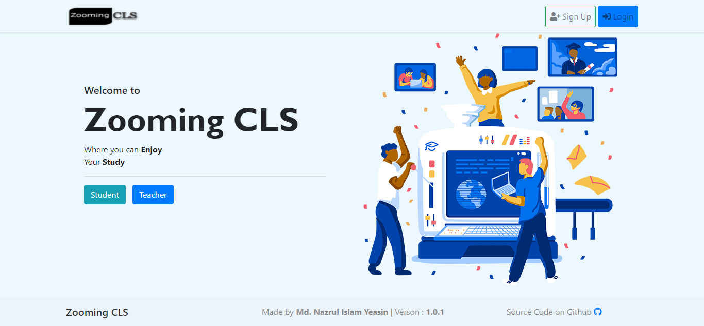

<div align="center">


<h1> Zooming cls ( Google Classroom Clone )</h2>

<hr>


[](https://www.python.org/)
 [](https://git-scm.com) [](https://visualstudio.microsoft.com) [](https://https://docker.com/)
 </div>
<br>
Clone the repository using the following command

```bash
git clone github.com/yeazin/Zooming-cls.git
# After cloning, move into the directory having the project files using the change directory command
cd Zooming-cls
```
Create a virtual environment where all the required python packages will be installed

```bash
# Use this on Windows
python -m venv env
# Use this on Linux and Mac
python3 -m venv env
```
Activate the virtual environment

```bash
# Windows
.\env\Scripts\activate
# Linux and Mac
source env/bin/activate
```
Install all the project Requirements
```bash
pip install -r requirements.txt
```
-Apply migrations and create your superuser (follow the prompts)
```bash
# apply migrations and create your database
python manage.py migrate

# Create a user with manage.py
python manage.py createsuperuser
```

Run the development server

```bash
# run django development server
python manage.py runserver
```
